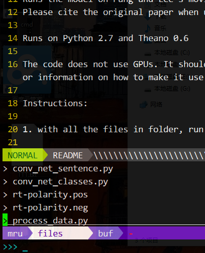

### VIM 插件配置

加入插件管理器 [vundle](https://github.com/VundleVim/Vundle.vim), 插件配置项中包含[vim-go](https://github.com/fatih/vim-go), 但未安装。

预装的插件包含 ctrlp ， NERDTree ， Powerline，由于历史原因，这些不是采用Vundle安装.

F2打开NERDTree

F4能够添加作者等信息

ctrl + p 打开 ctrlp功能

:PluginInstall 安装vundle管理的插件

#### 用法

直接运行`deploy.sh`

  ```shell
  sh deploy.sh
  ```

vundle的使用，见其官方说明。

#### 效果



#### 一些设置

1. 解决编辑Python文件时输入`#`号导致自动定位到行首的问题

    ```vimrc
    " http://stackoverflow.com/questions/2063175/comments-go-to-start-of-line-in-the-insert-mode-in-vim
    au! FileType python setl nosmartindent
    " or 
    " https://github.com/wklken/k-vim/issues/82
    autocmd BufNewFile,BufRead *.py inoremap # X<c-h>#
    ```
2. 解决使用`ctrl + space`切换输入法时vim进入到非正常编辑状态

    '''vimrc
    imap <Nul> <Space>
    '''
